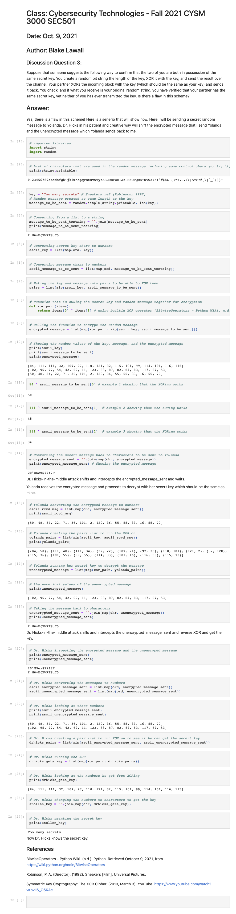

# Class: Cybersecurity Technologies - Fall 2021 CYSM 3000 SEC501
## Date: Oct. 9, 2021
## Author: Blake Lawall

### Discussion Question 3:
Suppose that someone suggests the following way to confirm that the two of you are both in possession of the same secret key. You create a random bit string the length of the key, XOR it with the key, and send the result over the channel. Your partner XORs the incoming block with the key (which should be the same as your key) and sends it back. You check, and if what you receive is your original random string, you have verified that your partner has the same secret key, yet neither of you has ever transmitted the key. Is there a flaw in this scheme?
## Answer:
Yes, there is a flaw in this scheme! Here is a senerio that will show how.
Here I will be sending a secret random message to Yolanda. Dr. Hicks in his patient and creative way will sniff the encrypted message that I send Yolanda and the unencrypted message which Yolanda sends back to me.

